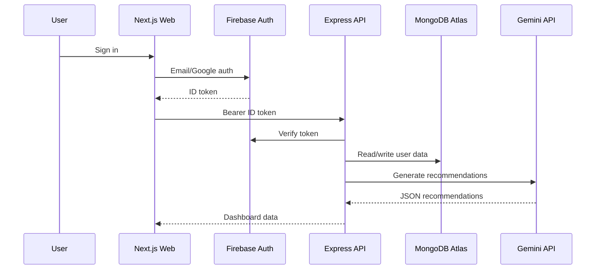

# Architecture

## System Overview

EcoHabit AI uses three deployable/logical layers:

1. **Next.js App Router frontend** renders the authenticated product experience, handles Firebase client auth, and requests API data with Firebase ID tokens.
2. **Express API** verifies tokens with Firebase Admin, validates requests with Zod, owns business logic, calls Gemini, and persists MongoDB documents.
3. **Shared package** centralizes emissions calculations, score rules, Zod schemas, constants, and TypeScript types.

## Why This Shape

- **Security boundary**: Gemini keys, Firebase Admin credentials, and MongoDB credentials only exist in the API process.
- **Maintainability**: frontend components do not duplicate carbon scoring or validation logic.
- **Scalability**: web and API can scale independently. Report generation and recommendation calls can later move to jobs without changing the UI contract.
- **Product focus**: data model supports awareness and engagement loops: log footprint, act on habits, generate reports, update score, unlock achievements, receive recommendations.

## Runtime Flow

## Key Modules

- `packages/shared/src/schemas.ts`: request contracts and domain types.
- `packages/shared/src/emissions.ts`: footprint breakdown calculation.
- `packages/shared/src/scoring.ts`: Eco Score and achievement candidate rules.
- `apps/api/src/middleware/auth.ts`: Firebase Admin ID token verification.
- `apps/api/src/services/reportService.ts`: weekly/monthly report aggregation and scoring.
- `apps/api/src/services/recommendationService.ts`: Gemini prompt construction, validation, and persistence.
- `apps/web/src/providers/auth-provider.tsx`: Firebase client auth state.
- `apps/web/src/components/dashboard`: analytics and engagement surfaces.
